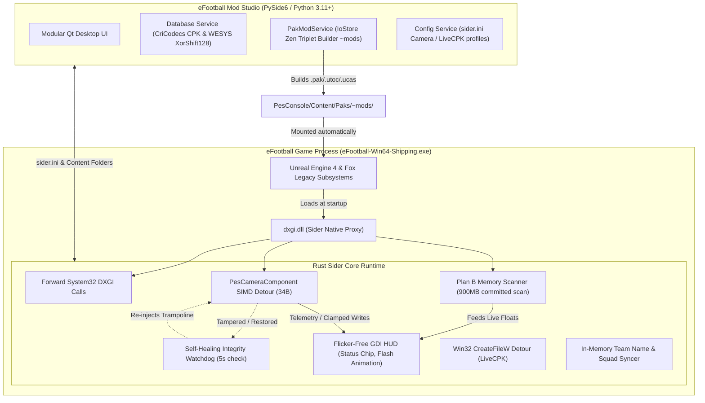

# eFootball Mod Studio

[](https://github.com/Master-Antonio/Efootball-Sider/actions/workflows/ci.yml)
[](LICENSE)
[](https://www.microsoft.com/windows)
[](https://www.rust-lang.org/)
[](https://www.python.org/)
[](https://github.com/astral-sh/ruff)

An open-source Windows modding studio and native runtime for current eFootball builds.

The project combines a Rust `dxgi.dll` proxy with a modular PySide6 desktop app. Its current strengths are database research, safe mod-package management, runtime diagnostics, and read-only asset discovery. Package-level Unreal IoStore replacement is supported through Zen Triplet compilation into `~mods`, while dynamic camera telemetry is powered by a 34-byte SIMD detour, an autonomous Plan B memory scanner, and a self-healing watchdog.

## Why "eFootball Mod Studio" (Architecture Paradigm Shift)

> [!NOTE]
> **Why this project is NOT a classic PES Sider**
> In classic Pro Evolution Soccer (PES) powered by the Fox Engine, **Sider** (pioneered by Juce) functioned primarily as a hook into Win32 file APIs (`CreateFileW`) and Lua memory scripts, serving loose files directly into the engine.
>
> In modern **eFootball**, the game runs on **Unreal Engine 4.26** with the **IoStore virtual container architecture** (`.ucas`, `.utoc`, `.pak`). Textures, meshes, and assets are streamed in bulk chunks from encrypted block containers, making pure loose-file file-hooking impossible for engine graphics.
>
> **eFootball Mod Studio** is purpose-built for eFootball's real architecture:
> 1. **Zen Triplet Compilation (`~mods`)**: Compiles loose cooked content directly into encrypted IoStore Zen Triplets (`.pak`, `.utoc`, `.ucas`) mounted natively by UE4 at boot with one-click auto-sync.
> 2. **WESYS Cryptography & DB Suite**: Decrypts and encodes live Konami `dt870` database records (`FF 22 83` XorShift128 keystream) with round-trip validation.
> 3. **Native Runtime Proxy (`dxgi.dll`)**: In-process engine companion with SIMD camera detours, autonomous Plan B memory scanner (continuous live apply), and GDI OSD HUD.
> 4. **Modern Desktop Studio**: A responsive PySide6 workspace for asset discovery, mod management, live camera tuning, and diagnostics.

## Status

| Area | State | Notes |
|---|---|---|
| Native DXGI proxy | Working | Rust proxy forwards required DXGI exports and initializes outside loader lock. |
| WESYS codec | Working | Current `FF 22 83` format, per-file seed, trailing-byte behavior, Python/Rust parity. |
| CPK extraction | Working | Selective `dt870` extraction through CriCodecs. |
| Player database | Working | Auto-detects 392-byte live and 400-byte base records. |
| Assignment database | Working | Supports v1 and current v2 layouts with cross-table validation. |
| Squad replacement core | Working | Changes PID fields only; rejects missing players and headcount changes. |
| Mod manager | Working | Safe ZIP import, path-traversal rejection, explicit `cpk.root` activation. |
| Asset discovery | Working, read-only | Incremental scan of asset references in eFootball memory. |
| Texture / audio / mesh injection | Working | **Build Zen Triplet** (retoc with the game AES key → `.pak`/`.utoc`/`.ucas`) compiles a content package into `PesConsole\Content\Paks\~mods`, which the game mounts automatically; one-click auto-sync and container enable/disable/delete supported. Loose-file overrides via `CreateFileW` remain limited to files the game opens loose (the basename fallback is off by default). |
| Camera controller | Working (Telemetry & Continuous Live Apply) | Dual-range adaptive scaling (< 10 relative, >= 10 native absolute), SIMD `PesCameraComponent` detour (`[rsi+0x105C..0x1068]`), paired with **Plan B Memory Scanner** (autonomous discovery and 250ms continuous live injection across 900MB committed memory) and **Self-Healing Watchdog** (auto-restores hook if modified by game integrity routines). |

## Desktop app

The Qt app is organized around the actual modding workflow:

- **Overview**: installation, native-core hash, database and package readiness.
- **Assets**: read-only discovery of loaded paths and mod-package scaffolding.
- **Database**: extract, decrypt, validate, filter and export live pesdb tables.
- **Mods**: install packages, inspect size and contents, manage active roots, build Zen Triplets into `~mods` and enable/disable/delete compiled containers.
- **Servers**: kit/stadium/ball server directory indexing (experimental; no runtime injection yet).
- **Camera**: edit profiles in `sider.ini`, choose telemetry/apply mode and inspect hook verification state.
- **Diagnostics**: ground-truth file checks and native log tail.
- **Settings**: game paths and workspace configuration.

All long-running file and memory operations use Qt workers. Tables use `QAbstractTableModel`, so tens of thousands of records are not copied into individual widgets.

## Architecture



```text
ui/
  app.py                 application entrypoint and screenshot mode
  main_window.py         navigation shell
  core/
    wesys.py             current and legacy WESYS codecs
    pesdb.py             record layouts, validation and squad edits
  services/
    database.py          CPK extraction and CSV export
    config.py            camera settings and mod roots
    game.py              install status, hashes, sync and logs
    memory.py            read-only process discovery
    paths.py             portable workspace/game path discovery
    paks.py              ~mods container lifecycle manager
    zen_builder.py       retoc IoStore compilation pipeline
  pages/                 eight focused application pages
  widgets/               shared visual primitives

rust_sider/
  src/lib.rs             DXGI proxy and lifecycle
  src/crypto.rs          native WESYS decoder C ABI
  src/livecpk.rs         experimental Win32 file-open interception
  src/camera.rs          PesCameraComponent detour, Plan B scanner, watchdog
  src/overlay.rs         GDI OSD HUD with dynamic status chip and flash anim
  src/teams.rs           in-memory team name & squad memory syncer
  src/ue4.rs             GUObjectArray scan (validated, experimental reflection)
```

## Requirements

- Windows 10 or 11, x64
- Python 3.11 or newer
- Rust stable toolchain (1.75+) when building `dxgi.dll` from source
- Steam eFootball installation

The game path is discovered from common Steam locations. Set `EFOOTBALL_GAME_DIR` to the eFootball root when it is installed elsewhere.

## Quick Start

### For Players and Modders (Prebuilt Release)
1. Download the latest `eFootball_Mod_Studio.zip` from [Releases](https://github.com/Master-Antonio/Efootball-Sider/releases).
2. Extract the archive into your preferred folder or inside the game root.
3. Run `Installa_Mod_Studio_in_eFootball.bat` as Administrator while the game is closed to sync `dxgi.dll`.
4. Launch the desktop app with `Avvia_Mod_Studio.bat`.

### For Developers & Researchers (Source Checkout)

```powershell
# 1. Clone repository
git clone https://github.com/Master-Antonio/Efootball-Sider.git
cd Efootball-Sider

# 2. Virtual environment setup
python -m venv .venv
.\.venv\Scripts\Activate.ps1
python -m pip install --upgrade pip
python -m pip install -r requirements.txt

# 3. Build native core
Set-Location rust_sider
cargo test
cargo build --release
Set-Location ..

# 4. Launch Studio
python -m ui
```

Use the **Sync Mod Studio** action in the app, or run `Installa_Mod_Studio_in_eFootball.bat` while the game is closed. Release archives include the compiled DLL; source checkouts build it locally and do not track compiler output.

## Database workflow

The Database page defaults to:

```text
<game-root>/cpk/dt870_console_win.cpk
```

Extraction writes only local workspace data under `.workspace/pesdb/`:

```text
live/
  packed/common/etc/pesdb/     original WESYS files
  decoded/common/etc/pesdb/    validated raw tables
  manifest.json                counts, layouts, warnings and SHA-256 hashes
```

On the Steam build inspected on 2026-08-17, validation produced:

- 34,303 Player records, 392 bytes each
- 23,163 PlayerAssignment v2 records
- 787 populated squads
- 975 Team records
- 100% assignment PID resolution against Player.bin

These values are evidence for that build, not constants. The parsers validate each new extraction instead of trusting the counts.

## Mod package layout

```text
content/
  My_Mod/
    mod.ini
    PesConsole/Content/...     cooked files at their virtual paths
```

Example metadata:

```ini
[MOD]
name = My Stadium
category = Stadium
author = Modder
version = 1.0
```

To make the game actually load cooked overrides, select the package on the Mods
page and press **Build Zen Triplet**: retoc compiles the folder into
`My_Mod_P.pak/.utoc/.ucas` inside `PesConsole\Content\Paks\~mods`, which UE4
mounts automatically at launch. The `~mods` table below the package list lets
you disable (rename with `.disabled`), re-enable or delete compiled containers.

Container naming follows two different rules:

```text
PesConsole/Content/Paks/
  pc9999_console_win_P.pak      <- game-owned folder: strict pcNNNN_console_win names
  ~mods/
    <AnyCustomName>_P.pak       <- mod folder: free custom names, `_P` patch suffix
    <AnyCustomName>_P.utoc         recommended so overrides win over base content
    <AnyCustomName>_P.ucas
```

Keep custom containers inside `~mods`; dropping arbitrary names into the `Paks`
root breaks the game's own numbering scheme.

Enabling a package adds an explicit root such as:

```ini
cpk.root = "content\My_Mod"
```

This controls loose-file lookup. It does not yet mount a replacement IoStore container.
The runtime no longer auto-indexes every child under `content/`; this makes package disable and load order deterministic. A legacy `cpk.root = "content"` still enables the entire tree intentionally.

## Runtime RE toolkit

Instruments used to map game-native camera units and diagnose runtime memory (details in
`docs/UNREAL_ENGINE_EFOOTBALL_ARCHITECTURE.md` §3):

- **Compact OSD HUD**: Glass panel with dynamic status chips (`LIVE` / `ACTIVE` / `WAITING` / `OFFLINE`),
  Sider config row, and live game-native camera values that **flash cyan/yellow for
  ~1s whenever the game changes them** — watch which field glows while you move
  an in-game slider. Double-buffered, flicker-free GDI rendering, DWM rounded corners.
  * Keyboard controls: `Space` hides/shows HUD, `F1` toggles freecam, `+`/`-` adjusts zoom, Numpad `8/2/4/6` adjusts height and pitch.
- **Plan B Memory Scanner**: Dynamic background worker crawling up to 900MB committed memory to discover and lock onto `PesCameraComponent` config blocks independently of code detour execution. Sets the OSD chip to `LIVE` as soon as an in-game slider moves.
- **Self-Healing Watchdog**: 5-second polling thread that monitors hook memory integrity and immediately re-injects the 34-byte trampoline if restored by game routines.
- **F9 marker**: writes `[MARK #n] zoom=… height=… angle=… fov=… flag=…` into the
  native log at the exact moment the key is pressed.
- **F10 dump**: snapshots 0x1200 bytes of the live `PesCameraComponent` to
  `<Win64>\camera_dumps\comp_<addr>_<ts>.bin` for binary inspection of component memory.

Mapping protocol: launch with `[camera] mode = telemetry`, move ONE in-game
camera slider at a time, press F9 right after each change, then inspect `sider_rust.log`
to identify the corresponding game-native camera parameters.

## Tests

```powershell
python -m unittest discover -s tests -v

Set-Location rust_sider
cargo test
```

Render a deterministic UI screenshot:

```powershell
python -m ui --screenshot .workspace\ui\database.png --page database --width 1440 --height 900
```

Build the release archive:

```powershell
python scripts\build_release.py
```

The output is `dist/eFootball_Sider_Studio.zip`.

## Safe Gaming, Anti-Cheat & Legal Disclaimer

> [!CAUTION]
> **Online Competition Warning**:
> eFootball Sider Studio is strictly designed for offline modding, visual enhancements, and reverse-engineering research.
> - **Anti-Cheat Notice**: eFootball utilizes server-side integrity checks and anti-cheat software (such as Easy Anti-Cheat - EAC). Using any DLL proxy or memory-hooking framework during online matchmaking or competitive eFootball League modes violates Konami's Terms of Service and may result in an **immediate and permanent account ban**.
> - **Fair Play Policy**: Sider does not provide gameplay cheats (no stat boosting, no aim assistance, no network lag switching, no currency exploits).
> - **User Responsibility**: Always backup original game files before installing mods. All memory discovery is read-only; database writes operate exclusively on extracted copies.
> - **Copyright Notice**: eFootball™ and KONAMI are registered trademarks of Konami Digital Entertainment Co., Ltd. This project is independent, community-driven, and is neither affiliated with nor endorsed by Konami.

## Contributing

See `CONTRIBUTING.md`. Reverse-engineering claims must include a reproducible file/build, offsets or record layout, and a regression test. UI changes must include an offscreen screenshot and keep blocking work outside the GUI thread.

## License

GPL-3.0. eFootball and KONAMI are trademarks of their respective owners. This project is independent and is not endorsed by KONAMI.